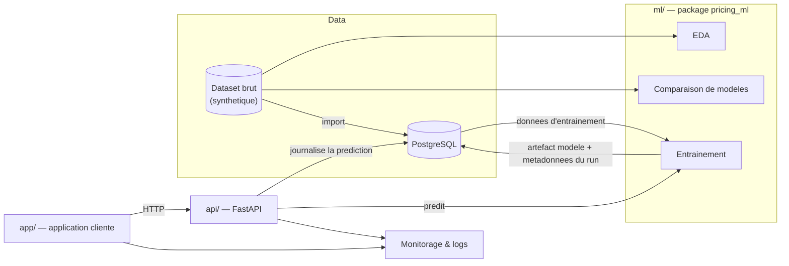

# industrial-pricing-ai

Prediction du prix d'un article industriel sur-mesure (dimensions, materiau,
profile, finition) a partir de l'historique des commandes, avec un pipeline
complet donnees → modele → API → application → monitorage.

> Projet personnel realise dans le cadre de la certification RNCP37827
> (Developpeur en Intelligence Artificielle). Toutes les donnees utilisees
> sont synthetiques/generiques — aucune donnee reelle d'entreprise n'est
> utilisee.

## Presentation

Tarifer manuellement un article industriel configure sur-mesure (un produit
verrier ou un panneau decoupe aux dimensions du client, par exemple) implique
generalement d'appliquer un ensemble de regles metier combinant dimensions,
cout matiere, cout du profile, finition et logistique. Ce projet reconstruit
cette logique de tarification sous la forme d'un petit systeme ML organise
comme en production :

1. **Explorer les donnees et selectionner un modele** a partir de
   l'historique des commandes.
2. **Stocker les donnees** dans un schema relationnel normalise
   (PostgreSQL).
3. **Servir les predictions** via une API REST documentee.
4. **Consommer l'API** depuis une application cliente legere.
5. **Monitorer** le modele et l'application en production, avec un exemple
   documente de gestion d'incident.

Chaque etape reste volontairement simple et demontrable plutot que
sur-construite — l'objectif est un pipeline complet et fonctionnel de bout
en bout.

## Architecture



## Stack technique

| Couche | Choix |
|---|---|
| Donnees / ML | Python, pandas, scikit-learn, matplotlib/seaborn |
| Base de donnees | PostgreSQL 16 (Docker) |
| API | FastAPI, cle API (`X-API-Key`), doc OpenAPI auto-generee |
| Application cliente | FastAPI + HTML/JS (application web minimale), proxy server-side vers l'API |
| Tests / CI/CD | pytest (unitaire + integration), GitHub Actions (tests + build wheels/image Docker) |
| Monitorage | logs structures / dashboard leger (a venir — Phase 5) |

## Structure du depot

```
industrial-pricing-ai/
├── docker-compose.yml       # services locaux (PostgreSQL ; API/app rejoindront en Phase 3/4)
├── .env.example             # gabarit des variables d'environnement
├── data/raw/                # dataset d'entrainement (synthetique)
├── ml/                      # package pricing_ml : EDA, feature engineering, comparaison de modeles
│   ├── pyproject.toml
│   ├── src/pricing_ml/      # data.py, features.py, models.py, evaluate.py, plots.py
│   ├── scripts/             # run_eda.py, run_compare_models.py
│   └── tests/               # tests unitaires (pytest)
├── db/                      # schema PostgreSQL (db/sql) et script d'import (db/scripts)
├── docs/
│   ├── merise/               # MCD.md, MPD.md (modele de donnees)
│   └── rgpd_registre.md      # registre des traitements de donnees personnelles
├── reports/                 # figures generees + analyse ecrite (choix du modele)
├── api/                     # API REST FastAPI exposant le modele
│   ├── pyproject.toml
│   ├── src/pricing_api/     # main.py, db.py, security.py, model_registry.py, features.py, schemas.py
│   ├── scripts/             # train_and_register.py (entraine + enregistre un modele en base)
│   ├── tests/                # unitaires (pas de DB) + integration (marker `integration`, Postgres reel)
│   ├── Dockerfile
│   └── model_artifacts/     # artefacts modeles (.joblib, non versionnes)
├── app/                     # application cliente (FastAPI + HTML/JS), proxy vers l'API
│   ├── pyproject.toml
│   ├── src/pricing_app/     # main.py (proxy), config.py, templates/, static/
│   ├── tests/
│   └── Dockerfile
└── .github/workflows/       # CI/CD (ci-cd.yml : tests ml/api/app, build wheels + image Docker)
```

## Demarrage

Prerequis : Python 3.11+, Docker Desktop.

```bash
git clone <repo-url>
cd industrial-pricing-ai
cp .env.example .env

# Package ML (preparation des donnees, EDA, comparaison de modeles)
pip install -e "./ml[dev]"
python ml/scripts/run_eda.py
python ml/scripts/run_compare_models.py

# Base de donnees
docker compose up -d db
cd db/scripts && pip install -r requirements.txt && python import_dataset.py

# API REST
pip install -e "./api"
python api/scripts/train_and_register.py       # entraine et enregistre un premier modele
uvicorn pricing_api.main:app --app-dir api/src --reload
# -> http://127.0.0.1:8000/docs

# Application cliente (dans un autre terminal, API deja lancee)
pip install -e "./app"
uvicorn pricing_app.main:app --app-dir app/src --reload --port 8090
# -> http://127.0.0.1:8090
```

> Port 8090 (pas 8080) : sur cette machine un serveur Apache/EnterpriseDB
> natif occupe deja le 8080 (meme type de conflit que PostgreSQL sur le
> port 5432, cf. `.env`).

Ou, entierement conteneurise (apres avoir entraine et enregistre un modele au moins une fois, cf. ci-dessus) :

```bash
docker compose up -d --build
# API   -> http://127.0.0.1:8000/docs
# App   -> http://127.0.0.1:8090
```

### Tests

```bash
pip install -e "./ml[dev]"  && pytest ml/tests -v
pip install -e "./api[dev]" && pytest api/tests -v   # necessite la base PostgreSQL (docker compose up -d db)
pip install -e "./app[dev]" && pytest app/tests -v
```

Les tests `api/` marques `integration` (voir `api/tests/conftest.py`) tournent contre une base
de test dediee (`<POSTGRES_DB>_test`, creee/reinitialisee automatiquement), jamais contre la
base de developpement.

## Documentation

| Sujet | Emplacement |
|---|---|
| Choix du modele (EDA, benchmarks, conclusion) | [reports/phase1_analysis.md](reports/phase1_analysis.md) |
| Modele de donnees (MCD/MPD) | [docs/merise/MCD.md](docs/merise/MCD.md), [docs/merise/MPD.md](docs/merise/MPD.md) |
| Registre des traitements de donnees personnelles (RGPD) | [docs/rgpd_registre.md](docs/rgpd_registre.md) |
| Mise en place de la base de donnees | [db/README.md](db/README.md) |
| API REST (endpoints, auth, exemples) | [api/README.md](api/README.md) |
| Application cliente (proxy, config, tests) | [app/README.md](app/README.md) |

## Feuille de route

- [x] Exploration des donnees et choix du modele
- [x] Stockage relationnel (PostgreSQL, modele de donnees Merise)
- [x] API REST exposant le modele de tarification
- [x] Application cliente, tests automatises, CI/CD
- [ ] Monitorage et exemple de gestion d'incident

## Licence

Projet personnel — aucune licence de reutilisation accordee.
