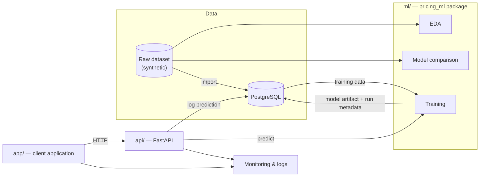

# industrial-pricing-ai

Predicting the price of a made-to-order industrial article (dimensions,
material, profile, finish) from historical order data, with a full
data → model → API → application → monitoring pipeline.

> Personal portfolio project built for the RNCP37827 certification (AI
> Developer). All data is synthetic/generic — no real company data is used.

## Overview

Manually pricing a custom-configured industrial article (a cut-to-size glass
or panel product, for example) usually means running a set of business rules
across dimensions, material cost, profile cost, finish and logistics. This
project reconstructs that pricing logic as a small, production-shaped ML
system:

1. **Explore & select a model** on historical order data.
2. **Persist the data** in a normalized relational schema (PostgreSQL).
3. **Serve predictions** through a documented REST API.
4. **Consume the API** from a lightweight client application.
5. **Monitor** the model and the application in production, with a
   documented incident response example.

Each stage is deliberately kept simple and demonstrable rather than
over-engineered — the goal is a complete, working pipeline end to end.

## Architecture



## Tech stack

| Layer | Choice |
|---|---|
| Data / ML | Python, pandas, scikit-learn, matplotlib/seaborn |
| Database | PostgreSQL 16 (Docker) |
| API | FastAPI (planned — Phase 3) |
| Client app | Streamlit or minimal web app (planned — Phase 4) |
| Tests / CI | pytest, GitHub Actions (planned — Phase 4) |
| Monitoring | structured logs / lightweight dashboard (planned — Phase 5) |

## Repository structure

```
industrial-pricing-ai/
├── docker-compose.yml       # local services (PostgreSQL; API/app join in later phases)
├── .env.example             # environment variables template
├── data/raw/                # training dataset (synthetic)
├── ml/                      # pricing_ml package: EDA, feature engineering, model comparison
│   ├── pyproject.toml
│   ├── src/pricing_ml/      # data.py, features.py, models.py, evaluate.py, plots.py
│   ├── scripts/             # run_eda.py, run_compare_models.py
│   └── tests/               # unit tests (pytest)
├── db/                      # PostgreSQL schema (db/sql) and import script (db/scripts)
├── docs/
│   ├── merise/              # MCD.md, MPD.md (data model)
│   └── rgpd_registre.md     # personal-data processing register
├── reports/                 # generated figures + written analysis (model selection)
├── api/                     # REST API exposing the model
├── app/                     # client application consuming the API
└── .github/workflows/       # CI/CD
```

## Getting started

Requirements: Python 3.11+, Docker Desktop.

```bash
git clone <repo-url>
cd industrial-pricing-ai
cp .env.example .env

# ML package (data prep, EDA, model comparison)
pip install -e "./ml[dev]"
python ml/scripts/run_eda.py
python ml/scripts/run_compare_models.py

# Database
docker compose up -d db
cd db/scripts && pip install -r requirements.txt && python import_dataset.py
```

## Documentation

| Topic | Where |
|---|---|
| Model selection (EDA, benchmarks, conclusion) | [reports/phase1_analysis.md](reports/phase1_analysis.md) |
| Data model (MCD/MPD) | [docs/merise/MCD.md](docs/merise/MCD.md), [docs/merise/MPD.md](docs/merise/MPD.md) |
| Personal-data processing register (GDPR) | [docs/rgpd_registre.md](docs/rgpd_registre.md) |
| Database setup | [db/README.md](db/README.md) |

## Roadmap

- [x] Data exploration and model selection
- [x] Relational data store (PostgreSQL, Merise data model)
- [ ] REST API exposing the pricing model
- [ ] Client application, automated tests, CI/CD
- [ ] Monitoring and incident-response walkthrough

## License

Personal project — no license granted for reuse.
