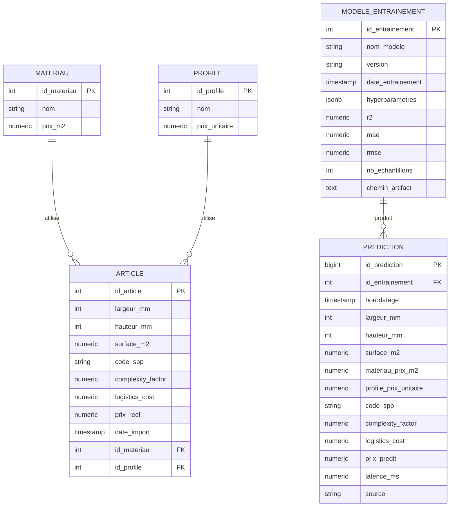

# Modele Conceptuel de Donnees (MCD) — pricing industriel

## Entites

**MATERIAU**
- id_materiau (identifiant)
- nom
- prix_m2

**PROFILE**
- id_profile (identifiant)
- nom
- prix_unitaire

**ARTICLE** (une ligne du dataset d'entrainement = un article deja tarife/commande)
- id_article (identifiant)
- largeur_mm
- hauteur_mm
- surface_m2
- code_spp
- complexity_factor
- logistics_cost
- prix_reel
- date_import

**MODELE_ENTRAINEMENT** (historique des entrainements du modele de prediction)
- id_entrainement (identifiant)
- nom_modele
- version
- date_entrainement
- hyperparametres
- r2 / mae / rmse
- nb_echantillons
- chemin_artifact

**PREDICTION** (historique des predictions faites en production)
- id_prediction (identifiant)
- horodatage
- largeur_mm, hauteur_mm, surface_m2
- materiau_prix_m2, profile_prix_unitaire, code_spp
- complexity_factor, logistics_cost
- prix_predit
- latence_ms
- source

## Associations et cardinalites

```
MATERIAU (1,n) ──── UTILISE ──── (1,1) ARTICLE
PROFILE  (1,n) ──── UTILISE ──── (1,1) ARTICLE
MODELE_ENTRAINEMENT (1,1) ──── PRODUIT ──── (0,n) PREDICTION
```

Lecture des cardinalites :
- Un `MATERIAU` peut etre utilise par 0 a n `ARTICLE` ; un `ARTICLE` utilise
  exactement 1 `MATERIAU` (1,1).
- Un `PROFILE` peut etre utilise par 0 a n `ARTICLE` ; un `ARTICLE` utilise
  exactement 1 `PROFILE` (1,1).
- Un `MODELE_ENTRAINEMENT` produit 0 a n `PREDICTION` ; une `PREDICTION` est
  produite par exactement 1 `MODELE_ENTRAINEMENT` (1,1).

`PREDICTION` ne reference pas `ARTICLE` : une prediction en production porte
sur une configuration saisie par un utilisateur (dimensions/materiau/profile
libres), pas necessairement sur un article historique deja en base. Les
features d'entree sont donc dupliquees a plat dans `PREDICTION` (denormalise
volontairement, cf. MPD) pour garder un historique fidele a ce qui a
reellement ete envoye a l'API au moment T, meme si le catalogue
`MATERIAU`/`PROFILE` change ensuite.

## Diagramme (notation entite-association, Mermaid)


